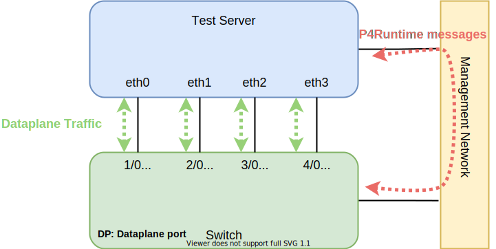
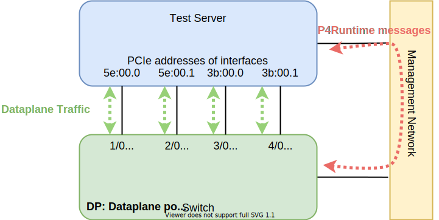
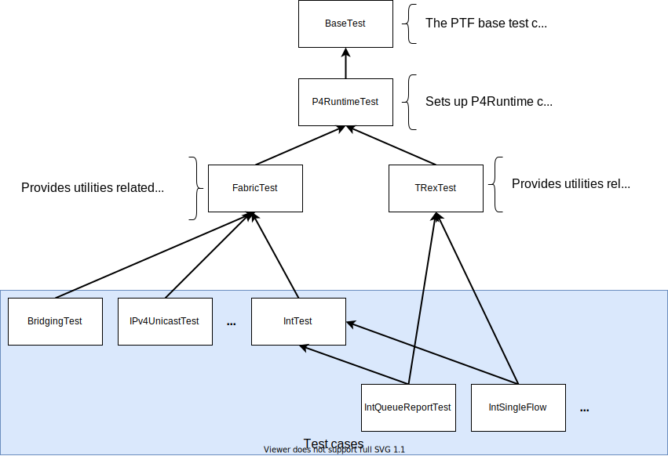

<!-- Copyright 2020-present Open Networking Foundation -->
<!-- SPDX-License-Identifier: Apache-2.0 -->
# PTF tests for fabric-tna

PTF is a framework for data plane testing:
<https://github.com/p4lang/PTF>

This directory maintains the test case definitions (written in Python), as well
as scripts to run them on different targets. Test cases can be found inside the
directory `tests/`. Run scripts can be found in `run/`.

Currently, we provide scripts to run these types of tests:

* **unary** tests that can run on top of:
  * Stratum with tofino-model
  * Stratum with a hardware Tofino switch
  * dummy target used to generate Stratum TestVectors
* **line rate** tests that can run with Stratum and a hardware Tofino switch to generate realistic traffic

## The unary test plan

In `fabric-tna` repository, we provide a collection of tests that test all features
from the pipeline.

Each test installs several table entries and use `scapy` packet library to craft and send
packets to the test device, and waiting for expected packets from the device.

Sometimes we also check the device state such as counter and register during the test.

Here are test groups for different pipeline profiles:

Profile          |  Test group
-----------------|---------------------------------------
fabric           | basic
fabric-int       | basic, INT, INT-dod
fabric-spgw      | basic, SPGW
fabric-spgw-int  | basic, SPGW, INT, SPGW+INT, INT-dod

### The basic test group

* PacketIO tests
* Bridging tests

  * VLAN tagged/untagged tests
  * ARP broadcast tests

* IPv4 Unicast tests

  * 5-tuple ECMP tests
  * MPLS tests

* IPv4 Multicast tests

### The SPGW/UPF test group

* Downlink tests

  * GTP-aware load balancing tests
  * Send to DBuf
  * Receive from DBuf

* Uplink tests

  * With/Without recirculate UE traffic

### The INT test group

* Flow report tests

  * Flow report filter tests
  * Loopback mode tests

* Drop report tests

  * Drop by ACL table
  * Drop by egress VLAN table
  * Drop report filter tests

* Queue report tests

  * Queue report filter quota tests

### The SPGW plus INT test group

* Downlink INT flow report tests
* Downlink INT drop report tests

  * Drop by PDR table
  * Drop by FAR table

* Uplink INT flow report tests
* Uplink INT drop report tests

  * Drop by PDR table
  * Drop by FAR table

## The line rate test plan

Another type of test is called `line rate test`, which uses [Trex](https://trex-tgn.cisco.com) framework to generate
the traffic with a higher rate (e.g., 40Gbps).

These type of test allows us to test some scenario like QoS, Meter, INT queue congestion report, and so on.

Here is the list of the current line rate test plan:

* INT single flow report: To verify if the INT flow report filter works in a simple line rate traffic.
* INT queue report: To create device queue congestion and verify if device can generate INT queue reports.
* INT traffic trace: Use a realistic traffic trace to test both INT flow report filter and drop report filter.
* QoS test: To verify if QoS policy we installed works correctly or not.

## Steps to run tests on tofino-model with Stratum

The run scripts assume that you have access to a containerized version of the
Intel Barefoot SDE that includes tofino-model. We do not provide such Docker
image, but one can be easily generated by executing the SDE install instructions
inside a `Dockerfile`.

The run script will use `docker run` to invoke the tofino-model command inside
the container. For this reason, the script expects a Docker image that has the
whole Barefoot SDE installed in it or just the tofino-model package. In both
cases, the tofino-model executable should be on `PATH`.

A Docker image for Stratum will be automatically downloaded when executing tests
for the first time.

**IMPORTANT: make sure to reserve at least 8GB of RAM** for your Docker host
system (or VM if running Docker Desktop for Mac), otherwise tofino-model might
fail to start or affect test results negatively.

### Steps

1. Build `fabric-tna` using instruction in the top-level README.

2. Set the `SDE_DOCKER_IMG` environment variable to the location of a Docker
   image that includes tofino-model:

   ```bash
    export SDE_DOCKER_IMG=my-docker-repo/bf-sde:9.5.0
    ```

3. Run PTF tests using the `run/tm/run` script:

    ```bash
    ./run/tm/run <profile> [test-case]
    ```

    To run all test cases for the basic `fabric` profile:

    ```bash
    ./run/tm/run fabric
    ```

    To run a specific test case against a specific profile,
    for example `test.FabricBridgingTest` for the `fabric-spgw` profile:

    ```bash
    ./run/tm/run fabric-spgw TEST=test.FabricBridgingTest
    ```

4. If tests fail, check logs in:

   * `run/tm/log` for tofino-model and Stratum logs
   * `tests/common/` for PTF-related logs and PCAP traces (`ptf.log` and
     `ptf.pcap`)

### Testing against custom Stratum builds

If you want to try a new Stratum build, but don't want to wait to build a new
Docker image for it, set the following env variable before running the PTF
tests.

```bash
export STRATUM_DOCKER_FLAG="-v /path/to/my/stratum_bfrt:/usr/bin/stratum_bfrt"
```

## Migrating to Stratum Test Vectors

We are currently in the process of migrating the test runner framework from PTF
to Stratum's [testvectors-runner].

For this reason, some PTF-based test case definitions are instrumented
to generate protobuf-based [TestVectors] (TVs) (under `tests/ptf/testvectors`).
The long-term goal is to remove all PTF references from the codebase, but
continue using Python as a convenient way to generate TVs. For now, we use a
Python library (`tvutils`) to wrap PTF and P4Runtime calls in methods that
generate TV's actions, stimuli and expectations instead of calling the
corresponding PTF or P4Runtime gRPC methods.

### Steps to generate TestVectors

The instructions to generate TVs are similar to running PTF tests on tofino-model.

1. Build `fabric-tna` using instruction in the top-level README.

2. Generate TestVectors using the `run/tv/run` script:

    ```bash
    ./run/tv/run <profile> [device] [portmap] [grpcaddr] [cpuport] [test-case]
    ```

   Default values for optional arguments are:
   1. `device`: `tofino`
   2. `portmap`: `portmap.veth.json`
   3. `grpcaddr`: `127.0.0.1:28000`
   4. `cpuport`: `320`

   Example command with all the optional arguments set:

   ```bash
   ./run/tv/run fabric DEVICE=tofino PORTMAP=port_map.hw.json GRPCADDR=10.128.13.111:28000 CPUPORT=320 TEST=test.FabricBridgingTest
   ```

    To generate TestVectors for the basic `fabric` profile:

    ```bash
    ./run/tv/run fabric
    ```

    To generate a specific test case for a specific fabric profile,
    for example `test.FabricBridgingTest` for the `fabric-spgw` profile:

    ```bash
    ./run/tv/run fabric-spgw TEST=test.FabricBridgingTest
    ```

## Running PTF tests with hardware device

To run PTF with a hardware switch, it requires a server with 4 network
interfaces (e.g., QSFP) which attached to the switch.

Figure below is an example of the topology, the current tests requires at least `4` links
connected to the device.

Before starting the test, check the `ptf/run/hw/port_map.hw.json` file to make sure each
port is configured correctly.



Based on this example, we can modify the file `ptf/run/hw/port_map.hw.json` with the port configuration like:

```json
    [
        {
            "p4_port": 1,
            "iface_name": "eth0"
        },
        {
            "p4_port": 2,
            "iface_name": "eth1"
        },
        {
            "p4_port": 3,
            "iface_name": "eth2"
        },
        {
            "p4_port": 4,
            "iface_name": "eth3"
        }
    ]
```

Before running the test, make sure all interfaces list in the port map file can be found
by `ip link` command.

To run PTF tests with hardware:

```bash
./ptf/run/hw/unary <profile> [TEST=test-case]
```

## Running line rate tests with hardware device

Before start running the line rate tests, you need to install TRex on your test server
see [TRex installation guide](https://trex-tgn.cisco.com/trex/doc/trex_manual.html#_download_and_installation) for more information.

Line rate tests for fabric-tna also requires a server with 4 network interfaces
attached to the switch.

For example, we have 4 QSFP(40Gbps) interface connect to the switch:



Before running the test, make sure TRex config file (`ptf/run/hw/trex-config/4-ports-with-l2.yaml`)
includes correct interface configuration.

```yaml
  port_limit: 4
  interfaces: ['5e:00.0', '5e:00.1', '3b:00.1', '3b:00.0']
  port_bandwidth_gb: 40
```

Rest of part of are the configuration for memory and CPU, see this [document](https://trex-tgn.cisco.com/trex/doc/trex_manual.html#_memory_section_configuration)
for more information.

For the PTF port mapping config(`ptf/run/hw/port_map.trex.json`), since we don't send or
receive packet with PTF framework, we will use dummy interface in the port mapping
config and only provide P4 port numbers.

To run the line rate test:

```bash
./ptf/run/hw/linerate <profile>
```

## Test result

The output of each test contains 3 parts:

* The test name
* The test log (if any)
* The test result and time

Below is an example of running the ``FabricBridgingTest``:

```text
test.FabricBridgingTest ...
Testing udp packet with VLAN tag->tag..
Testing gtp_psc_dl_udp packet with VLAN tag->tag..
                        <...skip...>
Testing gtp_psc_ul_icmp packet with VLAN untag->tag..
Testing tcp packet with VLAN untag->tag..
ok

----------------------------------------------------------------------
Ran 1 test in 10.154s

OK
```

When a test failed, it prints the error messages.

For example, when the expected packet is the the same as the actual packet:

```text
test.FabricBridgingTest ...
======================================================================
FAIL: test.FabricBridgingTest
----------------------------------------------------------------------
                        <...skip...>
AssertionError: Did not receive expected packets on port 1 for device 0.
========== EXPECTED ==========
dst        : MACField                            = '00:01:02:03:04:05' ("'00:00:00:01:00:00'")
src        : MACField                            = '00:00:10:00:00:00' ("'00:00:00:02:00:00'")
                        <...skip...>
========== RECEIVED ==========
1 total packets. Displaying most recent 1 packets:
------------------------------
dst        : MACField                            = '00:01:02:03:04:05' ("'00:00:00:01:00:00'")
src        : MACField                            = '00:06:07:08:09:0a' ("'00:00:00:02:00:00'")
                        <...skip...>
----------------------------------------------------------------------
Ran 1 test in 2.078s

FAILED (failures=1)
```

Note that when one test failed, the PTF will keep running until every test completed.

You will get the following message when test completed:

```text
    ******************************************
    ATTENTION: SOME TESTS DID NOT PASS!!!

    The following tests failed:
    Test1, Test2, ....
    ******************************************
```

Tip: You can use a diff tool(e.g., vimdiff) to compare the expected and actual result.

## Contribute new test cases

To create a new test for a new P4 pipeline feature, we have to understand few things:

* Which types of packet we want to support and where it enters the switch?

  * VLAN, IP, or special type like GTP
  * Packet from the normal port
  * Packet from the control plane

* How P4 pipeline process a packet?

  * Processed by which table, ASIC primitives, or the Traffic Manager component.

* What is the output, where we expect to get them?

  * Packet modification
  * Output with ECMP group
  * Output to the control plane
  * Packet dropped

* Do we expect any state updated?

  * Counter increased
  * Register changed

Once we can answer all questions above, we can start to create a new test.

### Create a new test class

There are 3 directories under `ptf/tests` directory.

The `common` directory contains common test functions and classes shared by unary test
and line rate tests.

Unary tests and line rate tests are placed in the `unary` and `linerate` directory.

Most of unary test groups such as `basic`, `spgw`, and `int` are placed in `ptf/tests/unary/test.py`.

Each class will be consider as a test. A test can contain multiple test cases that uses
different parameters.

Also, there are several base test classes in the repository, each base class provides different
utility functions for specific scenario.



To create a new unary test, create a new class in the `ptf/tests/unary/test.py`, we recommend
you to use the following template

```python
class MyTest(FabricTest):

    @autocleanup
    def doRunTest(self, param1, param2):
        # Actual test code with parameters

    def runTest(self):
        # The entrypoint of this test
        # Iterate all possible parameters and calls `doRunTest` function
```

The `@autocleanup` annotation will remove every P4Runtime entries after the test, which ensures
the state is clean before start running next test.

It alwaysis easiler to reuse base test classes and utilities from `ptf/tests/common/fabric_test.py`
module.

For example, extend the `IntTest` class for new INT tests, or extend `TRexTest`
if you want to create new line rate test.

[testvectors-runner]: https://github.com/stratum/testvectors-runner
[TestVectors]: https://github.com/stratum/testvectors
